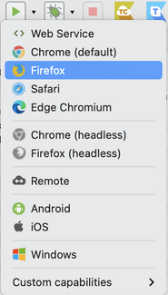

# Katalon 

Katalon Studio is an all-in-one test automation solution for Web, API, mobile, and desktop built for both beginners and expert testers.

Katalon Studio can work on macOS, Windows and Linux.

## Katalon Studio for Linux (GUI)
Install OpenJDK 8 
```bash
Katalon Studio for Linux currently supports OpenJDK 8 only.
```
To install OpenJDK 8 on your Ubuntu, open your Terminal. On the command line, type:
```bash
sudo apt-get install openjdk-8-jre
```
Once you finish the installation, your OpenJDK information is displayed when you execute **`java -version`** command.

If you have multiple versions of OpenJDK installed on your Ubuntu and the correct version is not being used, use the alternatives command to switch between them:
```bash
sudo update-alternatives --config java //then choose the openjdk-8-jre option
```

Verify the version of the JDK again using **`java -version`** command.

### Install Katalon
1. Go to the Katalon website: [Katalon products](https://katalon.com/download/).

2. Register a Katalon account with an active email or sign in to your Katalon account if you already have one.

3. To download Katalon Studio for Linux, click Create your first test in the Katalon Studio box. Katalon leads you to the downloading page where you will choose the Linux version of Katalon Studio, then click Download. A tar.gz file is being downloaded to your machine.


### Start Katalon Studio
1. Extract the tar.gz file. In the extracted folder, you can find the Katalon Studio app.

  Open Katalon Studio by double-clicking on Katalon Studio, or run cd ./katalon in your Terminal.


2. The Katalon Studio app launches, then the Katalon Studio Activation dialog appears. Sign in to your Katalon account to activate your license, or click Register to sign up. 

### Run a Test Case or a Test Suite
  In Katalon Toolbar, in the drop-down list of button Run, select an environment to run the test case. If you click on the Run button, the test case is executed using the default browser defined in Execution Settings.



## Katalon Runtime Engine (KRE)
Katalon Runtime Engine (KRE) is the test execution add-on of Katalon Studio. KRE allows you to execute automation tests in CLI mode. 

### Download KRE
1. Log in to your Katalon account on the Katalon website.

2. Select the compatible version of Katalon Runtime Engine with your operating system and download. For example, Linux version:


3. Unzip the package and move to the preferred directory to execute automation tests.

### Run a Test Case with Katalon Runtime Engine
1. Open KS and click on the Build CMD button in the main toolbar.


The Generate Command for Console Mode appears as below.


2. Configure your execution as follows:

Test Suite: select the TS/TSC you want to execute.
Executive Platform:

Run with: Click Edit to display the Select an environment dialog, select Chrome, then click OK.

3. Click Generate Command.
The Generated Command dialog appears as below.


4. Click Copy to Clipboard and paste the command to your cmd/terminal for execution.


